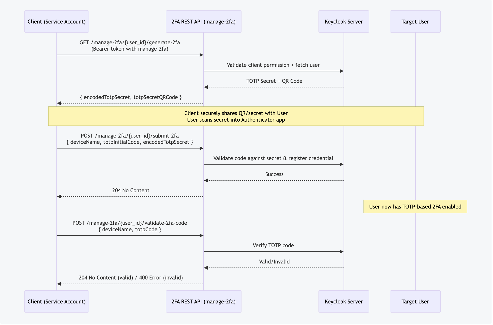

# 🔐 Keycloak 2FA REST API Extension

## Overview

This project extends **Keycloak** with a custom `RealmResourceProvider` to support **non-interactive 2FA (Two-Factor Authentication)** setup and management via REST APIs.

* APIs are secured with the `manage-2fa` permission.
* Calls must be made from a **service account client** with this permission.
* For security, the target user must **not** be a service account.

✨ With this extension, you can fully manage TOTP-based 2FA for Keycloak users through APIs.

---

### Flow

```
sequenceDiagram
    participant ClientApp as Client (Service Account)
    participant API as 2FA REST API (manage-2fa)
    participant Keycloak as Keycloak Server
    participant User as Target User

    ClientApp->>API: GET /manage-2fa/{user_id}/generate-2fa <br/> (Bearer token with manage-2fa)
    API->>Keycloak: Validate client permission + fetch user
    Keycloak-->>API: TOTP Secret + QR Code
    API-->>ClientApp: { encodedTotpSecret, totpSecretQRCode }

    Note over ClientApp,User: Client securely shares QR/secret with User<br/>User scans secret into Authenticator app

    ClientApp->>API: POST /manage-2fa/{user_id}/submit-2fa <br/> { deviceName, totpInitialCode, encodedTotpSecret }
    API->>Keycloak: Validate code against secret & register credential
    Keycloak-->>API: Success
    API-->>ClientApp: 204 No Content

    Note over User: User now has TOTP-based 2FA enabled

    ClientApp->>API: POST /manage-2fa/{user_id}/validate-2fa-code <br/> { deviceName, totpCode }
    API->>Keycloak: Verify TOTP code
    Keycloak-->>API: Valid/Invalid
    API-->>ClientApp: 204 No Content (valid) / 400 Error (invalid)
```



---

## API Security & Validation

All endpoints apply the following checks:

1. Caller is a **service account client** with `manage-2fa` permission.
2. The `{user_id}` in the path is a valid user.
3. Target user must **not** be a service account.

---

## API Endpoints

### 1. Generate 2FA Setup Data

**Description:** Creates TOTP secret for the user to register in their authenticator app (Google Authenticator, Authy, etc.).

* **Method:** `GET`
* **Path:** `/manage-2fa/{user_id}/generate-2fa`

**Response Example:**

```json
{
  "encodedTotpSecret": "OZJU43ZUIN2VO4BZKBYEWMLBOEZUSQKL",
  "totpSecretQRCode": "iVBORw0KGgoAAAANSUhEUgAAAPYAAAD2..."
}
```

** Export QR Code as PNG**
```
echo "iVBORw0KGgoAAAANSUhEUgAAAPYAAAD2..." | base64 --decode > qrcode.png
```

* `encodedTotpSecret`: Secret key for apps where QR scanning is not possible.
* `totpSecretQRCode`: Base64-encoded QR image for easy scanning.

---

### 2. Submit 2FA Setup Data

**Description:** Confirms and enables TOTP for a user’s device.

* **Method:** `POST`
* **Path:** `/manage-2fa/{user_id}/submit-2fa`

**Request Example:**

```json
{
  "deviceName": "test",
  "totpInitialCode": "709716",
  "encodedTotpSecret": "OZJU43ZUIN2VO4BZKBYEWMLBOEZUSQKL",
  "overwrite": true
}
```

* `deviceName`: Identifier for the user’s device.
* `totpInitialCode`: First 6-digit code from authenticator app.
* `encodedTotpSecret`: Secret previously generated.
* `overwrite`: If `true`, replaces existing 2FA credentials for this device.

✅ On success: returns **204 No Content**.

---

### 3. Validate 2FA Code

**Description:** Validates a user’s TOTP code for a given device.

* **Method:** `POST`
* **Path:** `/manage-2fa/{user_id}/validate-2fa-code`

**Request Example:**

```json
{
  "deviceName": "test",
  "totpCode": "700945"
}
```

* `deviceName`: Target device name.
* `totpCode`: Current 6-digit TOTP code from authenticator app.

✅ On success: returns **204 No Content**.

---

## Usage Notes

* You may use a constant `deviceName` if multi-device support is not required.
* The QR code or encoded secret must be shared securely with the user for initial setup.

---

## 📂 Path to Extension

APIs are available under your realm context:

```
/auth/realms/{realm}/two_factor_auth/manage-2fa/{user_id}/...
```

### To build jar
```
    mvn clean install
```

### To install keycloak on local
```
    docker-compose up -d
```
